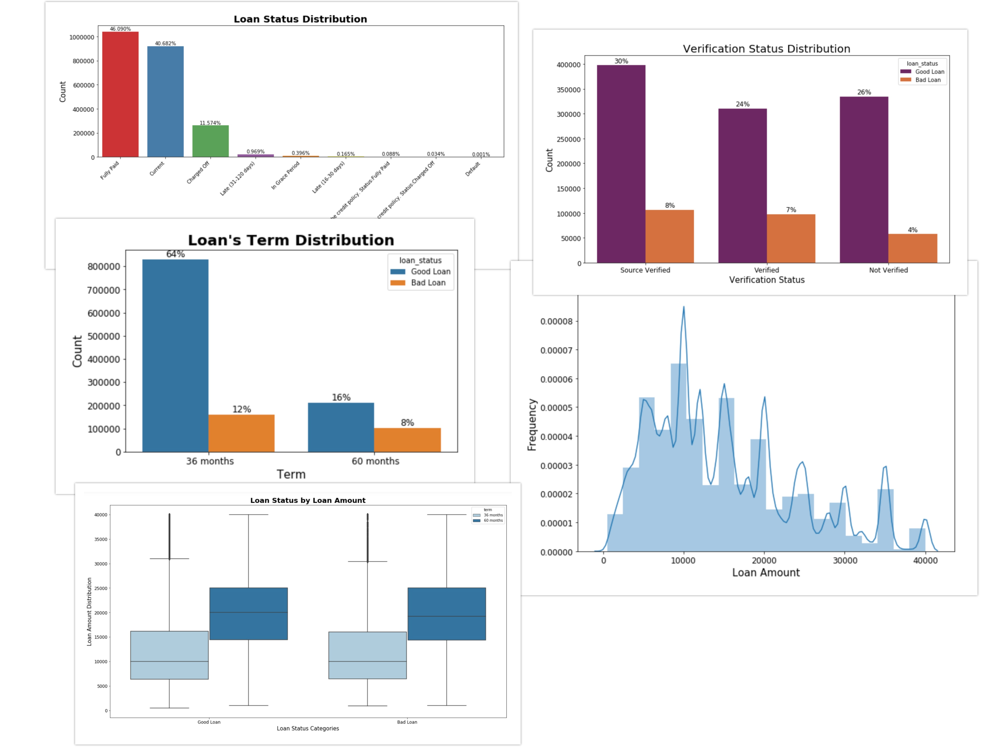
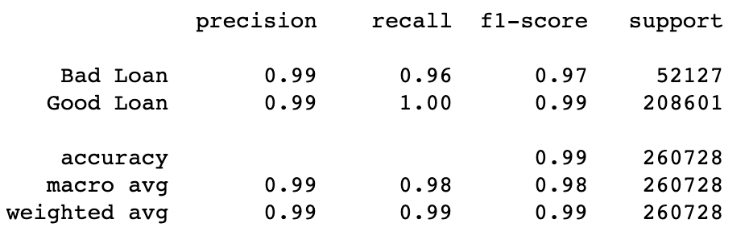
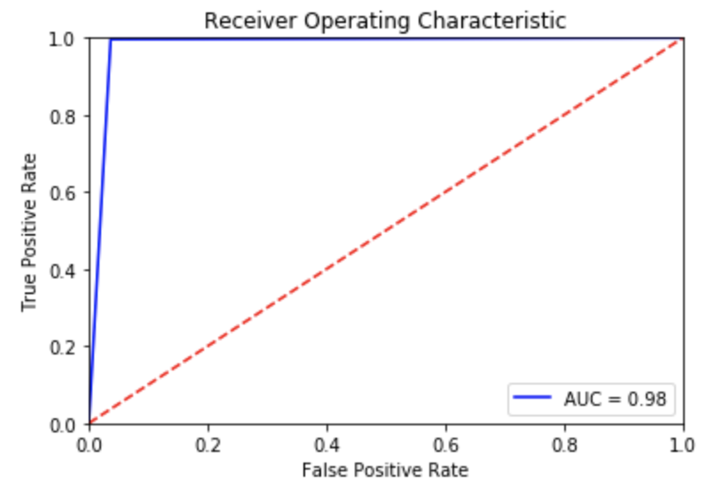

# End to End Data Science Project: Data Exploration and Visualisation, Machine Learning Classification Model

This project is an end-to-end data science project that uses data obtained from Lending Club Loan ([Kaggle](https://www.kaggle.com/wendykan/lending-club-loan-data)). 

This whole project consists of:
1. **Initialization:** Data Import and EDA (Exploratory Data Analysis) to analyse the raw data holistically.
2. **Data Visualisation:** using data visualisation library from Python (matplotlib, seaborn, pandas) to create chart that represents the data, aggregated and grouped by different factors. Some example charts:
    
3. **Machine Learning:** using the data provided, I made a machine learning model to classify whether a loan is categorised as *good* (if the loan is fully paid) or *bad* (if the loan is charged or default) that reach above 95% accuracy with 0.98 AUC score. Model used in the project is **Random Forest Classifier** algorithm. All the steps (feature selection, feature engineering, etc) and iteration to reach the final model is well explained in the notebook.
    
    

**How to run the program**
1. Clone this repo.
2. Download the data from [*here*](https://www.kaggle.com/wendykan/lending-club-loan-data). Place the *loan.csv* file under the folder *lending-club-loan-data* and put the folder under the same folder roof with this *ipynb* file. 
4. Run the notebooks. It will take a while to run the whole notebook, depends on your computer's performance.

If you want, you can also access the notebook via my Kaggle Kernel [*here*](https://www.kaggle.com/riantowibisono/loan-classification-machine-learning)

### **_Enjoy!_**

#

#### Albertus Rianto Wibisono ✉ _albertusrian95@gmail.com_

[Instagram](https://www.instagram.com/rian__wibisono) | 
[LinkedIn](https://www.linkedin.com/in/albertusrian95/) |
[GitHub](https://www.github.com/RiantoWibisono) |
[Kaggle](https://www.kaggle.com/riantowibisono)
